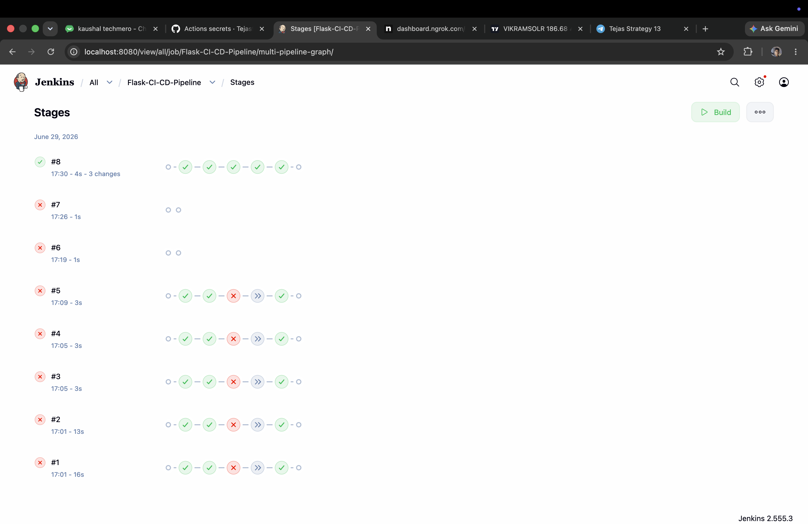
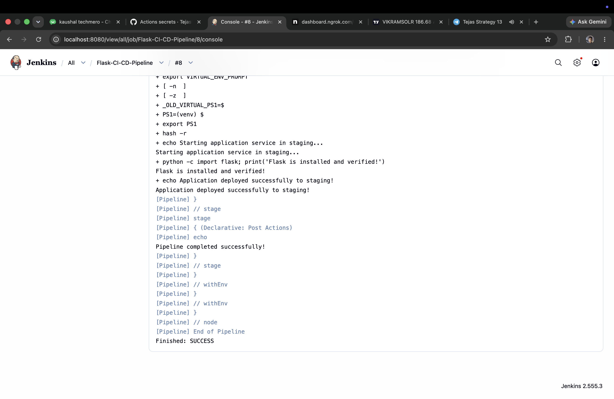
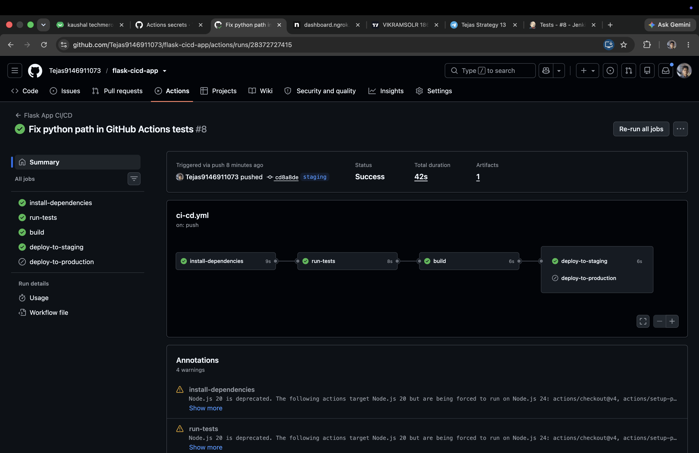
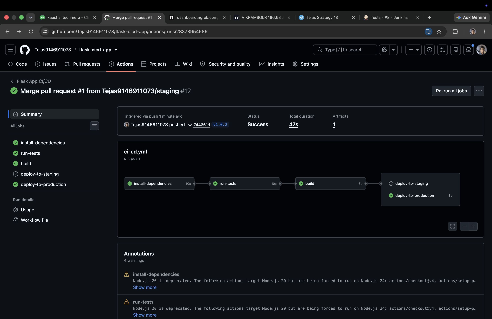

# Comprehensive CI/CD Pipeline Project (Flask Web App)

This repository contains a simple Python Flask web application and documents the step-by-step setup of automated CI/CD pipelines using both **Jenkins** and **GitHub Actions**.

---

## Table of Contents
1. [Project Repository & Code Setup](#1-project-repository--code-setup)
2. [Part 1: Jenkins CI/CD Pipeline Setup](#2-part-1-jenkins-cicd-pipeline-setup)
3. [Part 2: GitHub Actions CI/CD Pipeline Setup](#3-part-2-github-actions-cicd-pipeline-setup)
4. [How to Run Locally](#4-how-to-run-locally)

---

## 1. Project Repository & Code Setup

The repository is structured with a basic Flask application, dependency file, and a pytest testing suite.

### File Structure
```text
flask-cicd-app/
├── .github/
│   └── workflows/
│       └── ci-cd.yml
├── tests/
│   └── test_app.py
├── app.py
├── requirements.txt
├── Jenkinsfile
├── README.md
└── screenshots/
```

### Application Code (`app.py`)
```python
from flask import Flask

app = Flask(__name__)

@app.route('/')
def home():
    return "Hello, CI/CD World! This is a simple Flask App."

if __name__ == '__main__':
    app.run(host='0.0.0.0', port=5000)
```

### Dependencies (`requirements.txt`)
```text
flask==3.0.2
pytest==8.0.2
gunicorn==21.2.0
```

### Test Suite (`tests/test_app.py`)
```python
import pytest
from app import app as flask_app

@pytest.fixture
def app():
    yield flask_app

@pytest.fixture
def client(app):
    return app.test_client()

def test_home_page(client):
    """Test that home page returns 200 OK and expected text."""
    response = client.get('/')
    assert response.status_code == 200
    assert b"Hello, CI/CD World!" in response.data
```

---

## 2. Part 1: Jenkins CI/CD Pipeline Setup

This section details how Jenkins was installed, configured with Python, and integrated with GitHub via webhooks and email alerts.

### Step 1: Install and Run Jenkins
Jenkins was run using a Docker container with local port mapping:
```bash
docker run -d -p 8080:8080 -p 50000:50000 --name jenkins-server jenkins/jenkins:lts
```
To run Python commands, Python was installed inside the running container as root:
```bash
docker exec -u 0 -it jenkins-server bash
apt-get update && apt-get install -y python3 python3-pip python3-venv
```

### Step 2: Jenkins Pipeline Definition (`Jenkinsfile`)
```groovy
pipeline {
    agent any

    environment {
        PYTHON_ENV = 'venv'
    }

    stages {
        stage('Build') {
            steps {
                echo 'Setting up Python Virtual Environment...'
                sh '''
                    python3 -m venv ${PYTHON_ENV}
                    . ${PYTHON_ENV}/bin/activate
                    pip install --upgrade pip
                    pip install -r requirements.txt
                '''
            }
        }

        stage('Test') {
            steps {
                echo 'Running pytest tests...'
                sh '''
                    . ${PYTHON_ENV}/bin/activate
                    python -m pytest tests/ --junitxml=test-reports/results.xml
                '''
            }
            post {
                always {
                    junit 'test-reports/results.xml'
                }
            }
        }

        stage('Deploy') {
            steps {
                echo 'Deploying Flask application to Staging...'
                sh '''
                    . ${PYTHON_ENV}/bin/activate
                    echo "Starting application service in staging..."
                    python -c "import flask; print('Flask is installed and verified!')"
                    echo "Application deployed successfully to staging!"
                '''
            }
        }
    }

    post {
        success {
            echo 'Pipeline completed successfully!'
        }
        failure {
            echo 'Pipeline failed!'
        }
    }
}
```

### Step 3: Trigger & Webhook Setup
*   **GitHub Hook Trigger**: Enabled in Jenkins build configurations.
*   **ngrok Tunneling**: Exposed local Jenkins server (`localhost:8080`) to the public internet:
    ```bash
    ngrok http 8080
    ```
*   **Webhook**: Configured in GitHub Repository Settings using the Payload URL: `https://<YOUR_NGROK_SUBDOMAIN>.ngrok-free.app/github-webhook/`.

### Step 4: Email Notifications Configuration
*   Configured **System Admin e-mail address** in Jenkins Settings.
*   Enabled SMTP authentication for Gmail (`smtp.gmail.com`, Port `465`, SSL checked).
*   Configured the password using a Google account **App Password** for SMTP authentication.

### Jenkins Execution Screenshots

#### Jenkins Pipeline Stage View
*Displays the successful build, test, and deploy pipeline run.*


#### Jenkins Console Output
*Console log showing the successful build ending in SUCCESS status.*


---

## 3. Part 2: GitHub Actions CI/CD Pipeline Setup

This section details the configuration of GitHub Actions for multi-branch environments (`main`, `staging`, and tag-based release).

### Step 1: Branch Management
*   `main`: Primary development branch.
*   `staging`: Auto-deployments are pushed to this branch to trigger the staging environment job.

### Step 2: GitHub Actions Workflow (`.github/workflows/ci-cd.yml`)
```yaml
name: Flask App CI/CD

on:
  push:
    branches:
      - main
      - staging
    tags:
      - 'v*'

jobs:
  install-dependencies:
    runs-on: ubuntu-latest
    steps:
      - name: Checkout Code
        uses: actions/checkout@v4

      - name: Set up Python
        uses: actions/setup-python@v5
        with:
          python-version: '3.10'

      - name: Install Dependencies
        run: |
          python -m pip install --upgrade pip
          pip install -r requirements.txt

  run-tests:
    needs: install-dependencies
    runs-on: ubuntu-latest
    steps:
      - name: Checkout Code
        uses: actions/checkout@v4

      - name: Set up Python
        uses: actions/setup-python@v5
        with:
          python-version: '3.10'

      - name: Install Dependencies
        run: |
          python -m pip install --upgrade pip
          pip install -r requirements.txt

      - name: Run Pytest
        run: |
          python -m pytest

  build:
    needs: run-tests
    runs-on: ubuntu-latest
    steps:
      - name: Checkout Code
        uses: actions/checkout@v4

      - name: Set up Python
        uses: actions/setup-python@v5
        with:
          python-version: '3.10'

      - name: Build / Package Application
        run: |
          echo "Packaging application for deployment..."
          tar -czf app.tar.gz app.py requirements.txt

      - name: Upload Build Artifact
        uses: actions/upload-artifact@v4
        with:
          name: flask-app-build
          path: app.tar.gz

  deploy-to-staging:
    needs: build
    if: github.ref == 'refs/heads/staging' && github.event_name == 'push'
    runs-on: ubuntu-latest
    steps:
      - name: Download Build Artifact
        uses: actions/download-artifact@v4
        with:
          name: flask-app-build

      - name: Deploy to Staging Environment
        env:
          STAGING_API_TOKEN: ${{ secrets.STAGING_API_TOKEN }}
          STAGING_SERVER_IP: ${{ secrets.STAGING_SERVER_IP }}
        run: |
          echo "Connecting to staging server..."
          echo "Deploying build artifact to staging at $STAGING_SERVER_IP..."
          echo "Staging Deployment Completed Successfully!"

  deploy-to-production:
    needs: build
    if: startsWith(github.ref, 'refs/tags/v') && github.event_name == 'push'
    runs-on: ubuntu-latest
    steps:
      - name: Download Build Artifact
        uses: actions/download-artifact@v4
        with:
          name: flask-app-build

      - name: Deploy to Production Environment
        env:
          PROD_API_TOKEN: ${{ secrets.PROD_API_TOKEN }}
          PROD_SERVER_IP: ${{ secrets.PROD_SERVER_IP }}
        run: |
          echo "Connecting to production server..."
          echo "Deploying release ${{ github.ref_name }} to production at $PROD_SERVER_IP..."
          echo "Production Deployment Completed Successfully!"
```

### Step 3: Secrets Configuration
To enable the mock deployments, the following Repository Secrets were configured in **Settings -> Secrets and variables -> Actions**:
*   `STAGING_SERVER_IP`: IP/address of staging system (`192.168.1.100`).
*   `STAGING_API_TOKEN`: Authentication token for staging deployment.
*   `PROD_SERVER_IP`: IP/address of production system (`192.168.1.200`).
*   `PROD_API_TOKEN`: Authentication token for production deployment.

### GitHub Actions Execution Screenshots

#### 1. Staging Branch Deployment Run
*Successful execution of all jobs including the staging deployment step.*


#### 2. Production Release Tag Deployment Run
*Successful execution of all jobs including the production deployment step.*


---

## 4. How to Run Locally

If you clone this repository and want to run it:
1. Create a virtual environment: `python3 -m venv venv`
2. Activate it: `source venv/bin/activate`
3. Install packages: `pip install -r requirements.txt`
4. Run testing locally: `python -m pytest`
5. Start app: `python app.py`
